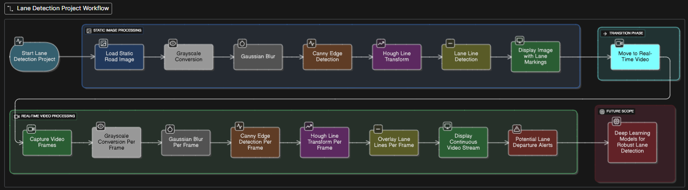

# 🚗 Lane Detection and Departure Warning System

<div align="center">
  
  
  
</div>

A real-time lane detection and departure warning system implemented using computer vision techniques. This project uses Canny edge detection and Hough transform to detect lane markings and provide visual feedback.

## 🎥 Demo


*Sample output showing lane detection and departure warning*

### 📺 Video Demo
Watch the complete demonstration on YouTube: [Lane Detection Demo](https://youtu.be/ZWo-vWFWAnk?si=6z19DTxxuaZ34wbu)

## ✨ Features

- 🛣️ Real-time lane detection using Canny edge detection
- 🎯 Hough transform for accurate line detection
- ⚠️ Lane departure warning system
- 🎞️ Video processing with output saving
- 🎛️ Adjustable parameters for different road conditions
- 🖥️ Clean and modular code structure

## 🛠️ Installation

1. Clone the repository:
   ```bash
   git clone https://github.com/AmitMandhana/Lane-Detection.git
   cd Lane-Detection
   ```

2. Install the required packages:
   ```bash
   pip install -r requirements.txt
   ```

## 🚀 Usage

1. Place your road video file (e.g., `test_video.mp4`) in the project directory

2. Run the lane detection script:
   ```bash
   python lane_detection.py
   ```

3. Controls:
   - Press `q` to quit the application
   - The processed video will be saved in the `output` directory

## 🧠 How It Works

### Algorithm Flowchart



*Complete algorithm flowchart showing the lane detection pipeline*

### Pipeline Overview

1. **Frame Preprocessing**
   - Convert to grayscale
   - Apply Gaussian blur to reduce noise
   
2. **Edge Detection**
   - Apply Canny edge detection to highlight lane markings
   
3. **Region of Interest (ROI)**
   - Focus on the road area using a trapezoidal mask
   
4. **Line Detection**
   - Apply Hough transform to detect line segments
   - Filter and average lines to form continuous lane markings
   
5. **Lane Departure Warning**
   - Monitor vehicle position relative to lane center
   - Trigger warning if deviation exceeds threshold

### Code Structure

```
Lane-Detection/
├── lane_detection.py  # Main implementation
├── requirements.txt   # Dependencies
└── README.md         # This file
```

## ⚙️ Parameters to Tune

| Parameter | Description | Recommended Value |
|-----------|-------------|-------------------|
| Canny Threshold 1 | First threshold for Canny edge detection | 50 |
| Canny Threshold 2 | Second threshold for Canny edge detection | 150 |
| Hough Rho | Distance resolution in pixels | 1 |
| Hough Theta | Angle resolution in radians | π/180 |
| Hough Threshold | Minimum number of votes | 50 |
| Min Line Length | Minimum line length to be detected | 50 |
| Max Line Gap | Maximum gap between line segments | 100 |

## 📊 Sample Results

| Input Frame | Edge Detection | Final Output |
|-------------|----------------|---------------|
|  |  |  |

## 📂 Sample Videos

You can find sample road videos from these sources:
- [Udacity Self-Driving Car Dataset](https://github.com/udacity/self-driving-car/tree/master/datasets)
- [Kaggle Road Segmentation](https://www.kaggle.com/datasets/andrewmvd/road-segmentation)
- [Kaggle Lane Detection](https://www.kaggle.com/datasets/brsdincer/lane-detection)

## 🚀 Getting Started Guide

### 1. Prerequisites
- Python 3.6 or higher
- OpenCV
- NumPy

### 2. Running the Project
```bash
# Clone the repository
git clone https://github.com/AmitMandhana/Lane-Detection.git
cd Lane-Detection

# Install dependencies
pip install -r requirements.txt

# Run the lane detection
python lane_detection.py
```

## 🛠️ Customization

### Adjusting Parameters
You can modify the following parameters in `lane_detection.py` for better results:

```python
# Canny Edge Detection
edges = cv2.Canny(blur, 50, 150)  # Adjust thresholds (50, 150)

# Hough Transform Parameters
lines = cv2.HoughLinesP(
    roi,
    rho=1,                      # Distance resolution
    theta=np.pi/180,            # Angle resolution
    threshold=50,               # Minimum votes
    minLineLength=50,           # Minimum line length
    maxLineGap=100              # Maximum gap between lines
)
```

## 🧪 Testing

To test with your own video:
1. Place your video file in the project directory
2. Update the `video_path` in `lane_detection.py`
3. Run the script

## 🤝 Contributing

Contributions are welcome! Please feel free to submit a Pull Request.

## 📄 License

This project is licensed under the MIT License - see the [LICENSE](LICENSE) file for details.

## 🙏 Acknowledgments

- OpenCV for the amazing computer vision library
- NumPy for numerical computing
- All contributors who helped improve this project
